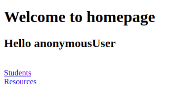
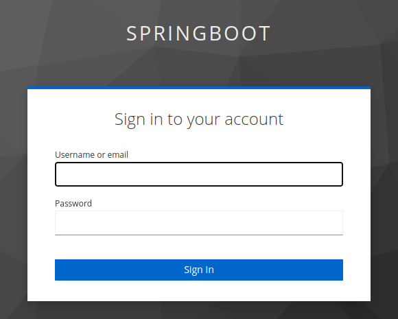
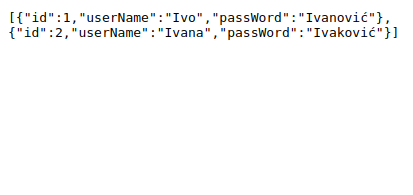
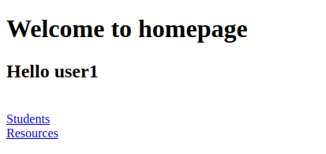

# Izvještaj

Upute za postavljanje aplikacije i Keycloaka su [ovdje](README.md).

Prije svega, dodat ćemo nove biblioteke u `dependencies` u pom.xml:
- `spring-boot-starter-security`
  - Opća biblioteka za sigurnost u Spring bootu.
- `spring-boot-starter-oauth2-client`
  - Klijent za oauth2. Naša aplikacija pristupa Keycloaku kao klijent.
- `spring-boot-starter-oauth2-resource-server`
  - Naša aplikacija je ujedno u resource server, onda nudi podatke o studentima i resursima.

Zatim je potrebno postaviti postavke aplikacije u `application.yml`:
- Koristit ćemo `openid` i `authorization_code` tip.
Naša aplikacija prvo dovhaća autorizacijski kod te onda pomoću njega dobiva pristupni token.
- Keycloak je postavljen na zadanom portu pa je njegova adresa `http://localhost:8080/realms/springboot`.
Zadnji dio adrese predstavlja naziv realm-a koji smo prethodno postavili na `springboot`.
Klijent smo nazvali `lab1`.
- Adresu Keycloaka predajemo i resource server-u jer on validira token.
- Koristi se H2 baza sa zadanim postavkama, u obliku datoteke `./data/db.mv.db`.
- Konačno, port aplikacije postavljamo na `8000`.

Unutar paketa `db` nalazi se razred Init za inicijalno popunjavanje baze.
Pokreće se automatski s aplikacijom.
Može se proširiti po potrebi.

Dodan je i HomeController za prikaz početne stranice.
Sam HTML se nalazi u `resources/templates/home.html`, a prikazaju jednostavnu početnu stranicu na kojoj se nalazi ime korisnika.

Pristup aplikaciji reguliramo pomoću razreda `WebSecurityConfig`.
U njemu postavljamo `antMatchers` na određene URL-ove ta za svaki određuje tko mu ima pristup po rolama.
- `/` je dozvoljen svima
- `/students` mogu pristupiti svi ulogirani korisnici
- `/resources` mogu pristupiti samo administratori
- na kraju se pomoću `anyRequest()` postavljaju svi ostali URL-ovi, za koje je potreban login

Važno je još postaviti `http.oauth2ResourceServer` koji se bavi pretvorbom tokena i utvrđivanjem ima li korisnik pravo na traženi resurs.
Unutar zagrada definira se pretvornik JWT token od Keycloaka u token koji Springboot Security razumije.
Ovdje je korišten zadani pretvornik: `OAuth2ResourceServerConfigurer::jwt`.

Ovaj pretvornik ne podržava Keycloak role stoga se role ispravno ne evaluiraju.
Potrebno bi bilo napraviti prilagođen pretvornik koji bi tražio polje `realm_access.roles`.
Nažalost, nakon više različitih pokušaja, nisam ga uspio napraviti.

# Demonstracija

Dolazimo po prvi put na stranicu, nismo autentificirani.

Zatim, odabiremo Students, što nas prebaci na login stranicu od Keycloaka za realm `springboot`.

Nakon logina (user1: user1), otvara se stranica koja prikazuje studente.

Ako se sad vratimo na početnu stranicu, vidjet ćemo naše ime.

